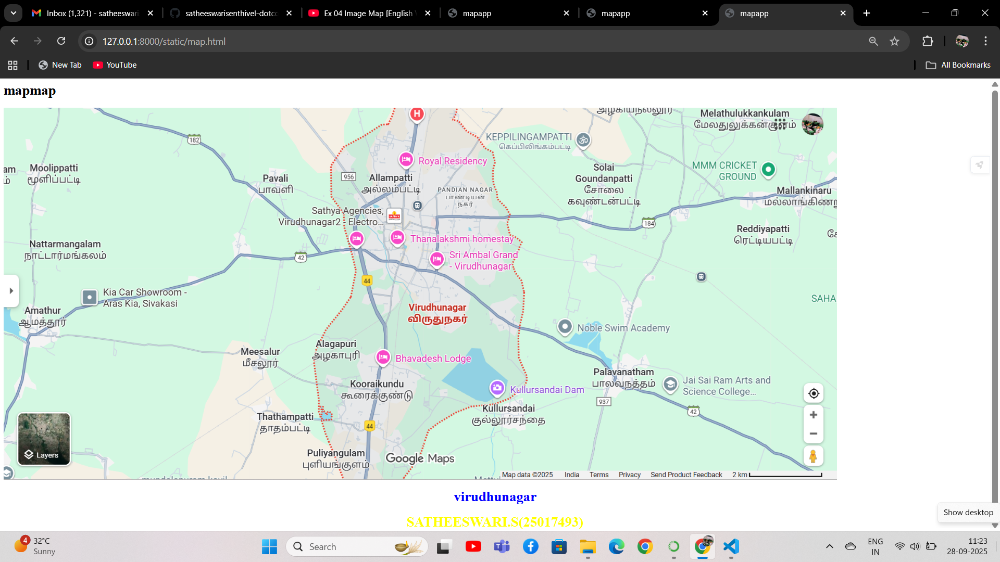
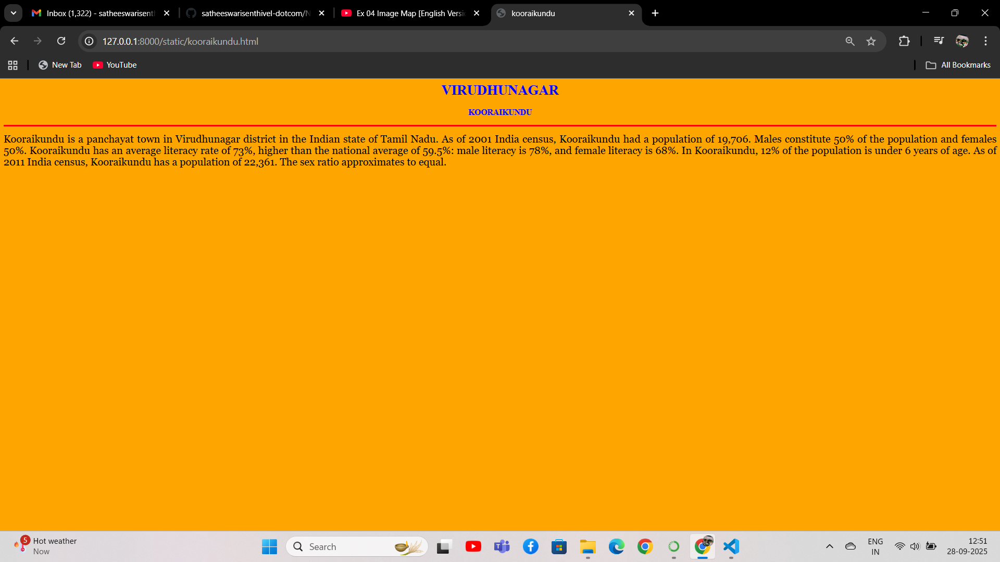
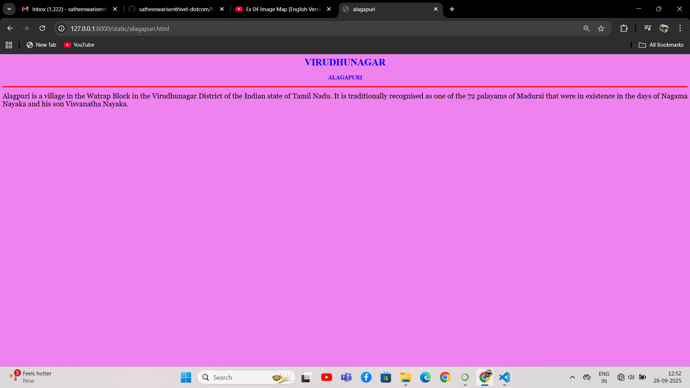
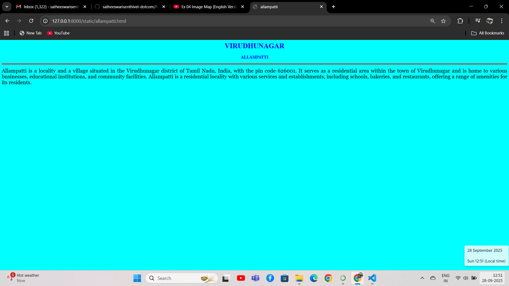
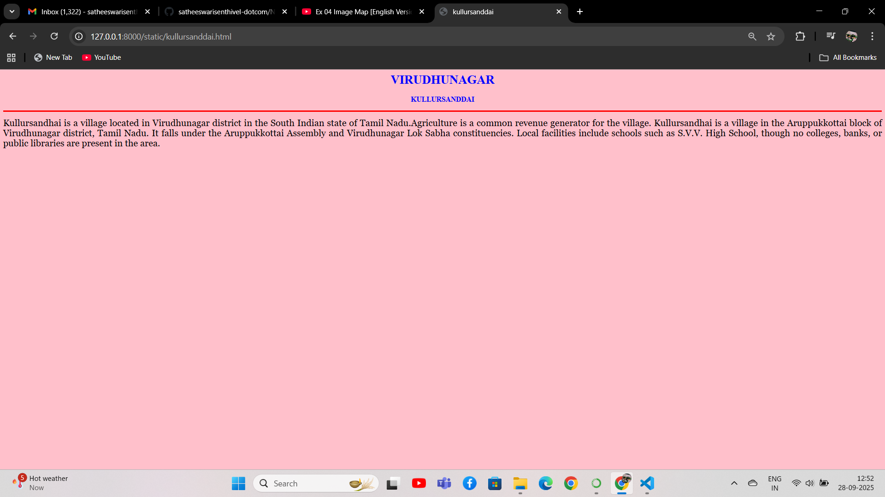

# Ex04 Places Around Me
## Date: 28.09.2025

## AIM
To develop a website to display details about the places around my house.

## DESIGN STEPS

### STEP 1
Create a Django admin interface.

### STEP 2
Download your city map from Google.

### STEP 3
Using ```<map>``` tag name the map.

### STEP 4
Create clickable regions in the image using ```<area>``` tag.

### STEP 5
Write HTML programs for all the regions identified.

### STEP 6
Execute the programs and publish them.

## CODE
```
map.html
<html>
    <head>
        <title>
            mapapp
        </title>
        <link rel="stylesheet" href="style.css">
    </head>
    <body>
        <h1> mapmap</h1>
        <h1 align="center">
        <font color="blue"><b>virudhunagar</b></font>
        </h1>
        <h1 align="center">
            <font color="yellow"><b>SATHEESWARI.S(25017493)</b></font>
        </h1>
        

<map name="image-map">
    <area target="" alt="kooraikundu" title="kooraikundu" href="kooraikundu.html" coords="768,614,957,689" shape="rect">
    <area target="" alt="allampatti" title="allampatti" href="allampatti.html" coords="891,192,64" shape="circle">
    <area target="" alt="kullursandai" title="kullursandai" href="kullursanddai.html" coords="1098,637,1149,632,1218,678,1232,737,1073,742,1076,698,1083,661" shape="poly">
    <area target="" alt="sri ambal grand" title="sri ambal grand" href="sri ambal.html" coords="964,325,1191,389" shape="rect">
    <area target="" alt="alagapuri" title="alagapuri" href="alagapuri.html" coords="752,555,60" shape="circle">
</map>
</body>
</html>

sri ambal.html
<html>
    <head>
        <title>sri ambal</title>
    </head>
    <body bgcolor="green">
    <h1 align="center">
        <font color="blue"><b>VIRUDHUNAGAR</b></font>
    </h1>
    <h3 align="center">
        <font color="blue"><b>SRI AMBAL</b></font>
    </h3>
    <hr size="3" color="red">
    <p align="justify">
    <font face="georgia" size="5">
        Comfortable Accommodations: Sri Ambal Grand in Virudhunagar offers family rooms equipped with air-conditioning, bath, hairdryer, free toiletries, shower, TV, sofa, tiled floors, electric kettle, and wardrobe. Each room includes a sofa bed for added comfort.

Convenient Facilities: Guests benefit from a 24-hour front desk and free on-site private parking. Additional amenities include free WiFi, sofa, and sofa bed.

Prime Location: Located 43 km from Madurai Airport and 2 km from Virudunagar Junction Railway Station, the hotel provides easy access to local attractions.

Highly Rated by Guests: Sri Ambal Grand is highly rated by guests for its excellent service and comfortable accommodations.

Couples in particular like the location – they rated it 8.0 for a two-person trip.
    </font>
    </p>
    </body>
</html>

kooraikundu.html
<html>
    <head>
        <title>kooraikundu</title>
    </head>
    <body bgcolor="orange">
    <h1 align="center">
        <font color="blue"><b>VIRUDHUNAGAR</b></font>
    </h1>
    <h3 align="center">
        <font color="blue"><b>KOORAIKUNDU</b></font>
    </h3>
    <hr size="3" color="red">
    <p align="justify">
    <font face="georgia" size="5">
    Kooraikundu is a panchayat town in Virudhunagar district in the Indian state of Tamil Nadu.
    As of 2001 India census, Kooraikundu had a population of 19,706. Males constitute 50% of the population and females 50%. Kooraikundu has an average literacy rate of 73%, higher than the national average of 59.5%: male literacy is 78%, and female literacy is 68%. In Kooraikundu, 12% of the population is under 6 years of age.
    As of 2011 India census, Kooraikundu has a population of 22,361. The sex ratio approximates to equal.
    </font>
    </p>
    </body>
</html>

alagapuri.html
<html>
    <head>
        <title>alagapuri</title>
    </head>
    <body bgcolor="violet">
    <h1 align="center">
        <font color="blue"><b>VIRUDHUNAGAR</b></font>
    </h1>
    <h3 align="center">
        <font color="blue"><b>ALAGAPURI</b></font>
    </h3>
    <hr size="3" color="red">
    <p align="justify">
    <font face="georgia" size="5">
    Alagpuri is a village in the Watrap Block in the Virudhunagar District of the Indian state of Tamil Nadu. It is traditionally recognised as one of the 72 palayams of Madurai that were in existence in the days of Nagama Nayaka and his son Visvanatha Nayaka.
    </font>
    </p>
    </body>
</html>

allampatti.html
<html>
    <head>
        <title>allampatti</title>
    </head>
    <body bgcolor="cyan">
    <h1 align="center">
        <font color="blue"><b>VIRUDHUNAGAR</b></font>
    </h1>
    <h3 align="center">
        <font color="blue"><b>ALLAMPATTI</b></font>
    </h3>
    <hr size="3" color="red">
    <p align="justify">
    <font face="georgia" size="5">
    Allampatti is a locality and a village situated in the Virudhunagar district of Tamil Nadu, India, with the pin code 626001. It serves as a residential area within the town of Virudhunagar and is home to various businesses, educational institutions, and community facilities. 
    Allampatti is a residential locality with various services and establishments, including schools, bakeries, and restaurants, offering a range of amenities for its residents. 
    </font>
    </p>
    </body>
</html>

kullursanddai.html
<html>
    <head>
        <title>kullursanddai</title>
    </head>
    <body bgcolor="pink">
    <h1 align="center">
        <font color="blue"><b>VIRUDHUNAGAR</b></font>
    </h1>
    <h3 align="center">
        <font color="blue"><b>KULLURSANDDAI</b></font>
    </h3>
    <hr size="3" color="red">
    <p align="justify">
    <font face="georgia" size="5">
    Kullursandhai is a village located in Virudhunagar district in the South Indian state of Tamil Nadu.Agriculture is a common revenue generator for the village. Kullursandhai is a village in the Aruppukkottai block of Virudhunagar district, Tamil Nadu. It falls under the Aruppukkottai Assembly and Virudhunagar Lok Sabha constituencies. Local facilities include schools such as S.V.V. High School, though no colleges, banks, or public libraries are present in the area.
    </font>
    </p>
    </body>
</html>
```


## OUTPUT








## RESULT
The program for implementing image maps using HTML is executed successfully.
